# Which side of the street: two methods for assigning a label a side, scored against SDOT

**2026-09-03** · [#2886](https://github.com/ProjectSidewalk/SidewalkWebpage/issues/2886) (the ask), feeding
[#1155](https://github.com/ProjectSidewalk/SidewalkWebpage/issues/1155) (sidewalk topology) and the per-side
`NoSidewalk` rule the validation queue work ([#4715](https://github.com/ProjectSidewalk/SidewalkWebpage/issues/4715))
wants next · Seattle, every real label · tool and every number in `tools/street_side/`

| | |
|---|---|
| **89.5%** | of the 266,252 Seattle labels both methods can decide, the geometric method (side of the estimated position) and the heading method (sign of the camera-to-label bearing against the road bearing) give the same side. The rest is where the methods can be told apart |
| **93–96%** | on the labels where the two methods *disagree*, how often the geometric one is right, on every independent truth set with a usable sample: 93.4% of 12,880 curb-ramp disagreements, 96.4% of 948 on-sidewalk disagreements, 94.6% of 92 `NoSidewalk` disagreements. The heading method wins only the one truth set this report shows to be contaminated (§4.4.4) |
| **99.7% → 18.5%** | the heading method's accuracy as the camera moves off the audited street: 99.7% with the camera within a metre of the centerline, 88% at 5–8 m, 45% at 8–15 m, 18.5% beyond. One label in five (20.4%) has its camera more than 5 m off the audited centerline, and at corners the camera is nearer the cross street for over half of all curb-ramp labels. The geometric method does not move: 99.2–99.8% across the same bands |
| **2.2%** | of the 167,218 labels evolution 352 repositioned changed geometric side. The flips live where the label is near the line: 26.7% within 1 m, 12% at 1–2 m, 1.6% at 3–4 m, 0.2% beyond 4 m. With a 1 m floor the rate is 1.3%; the heading method cannot flip (it never reads the position), which is the one argument it keeps |
| **3.8%** | the unresolvable fraction under the recommended rule (geometric side against the audited street, `NULL` within 1 m of the centerline or without a position): 3.5% of labels sit within a metre of the line, where either method is a coin flip and the reposition flipped a quarter of them. By type: `NoSidewalk` 6.6% unresolved, `Crosswalk` 35% (a crosswalk is *in* the road; its side is ill-defined), the other main types 1.5–2.6% (`Occlusion` 5.3%, `Other` 15.6%) |
| **2 m ≈ 97%** | the side's accuracy is a monotone, type-independent function of the label's distance from the centerline, the same on both clean truth sets: 63–70% under 0.5 m, 84–87% at 0.5–1 m, 94–96% at 1–1.5 m, 97–98% at 1.5–2 m, 99%+ from 3 m. Distance from the *camera* does not hurt it (97.5–100% at every range up to 24 m+). So the margin itself is the confidence: store it signed, in metres, and let consumers pick their threshold (§5.4) |
| **no hybrid** | beats it. Every rule that mixes the two methods, and a cross-validated logistic combination of both methods' margins, lands on the geometric floor's accuracy-versus-coverage curve to the second decimal (§4.6). The estimated position *is* the heading ray plus a distance, so the heading method holds a strict subset of the geometric information; it can only add something where the distance error crosses the centerline, the sub-metre band, and there it is a 77% coin flip itself |
| **1 of 6** | `NoSidewalk` labels on SDOT's one-sided streets that sit within 4 m of the walkway SDOT says is paved (117 of 738). Both methods put them on the paved side and the heading method needs no position to do so, so they are not side errors: the label and the inventory disagree about whether a sidewalk is there. Any per-side `NoSidewalk` consumer inherits that disagreement, not a computation error |

> Reproduce (offline, from the dev database; ~6 min): `tools/street_side/README.md`. The SDOT layers were pulled
> 2026-09-03 and refresh weekly; the label data is `sidewalk_seattle` at evolution 352.

## §1 · Goals

[#2886](https://github.com/ProjectSidewalk/SidewalkWebpage/issues/2886) asks for an algorithmic way to say which
side of its street a label is on. Nothing in the schema records it: a label carries the street it was placed from
(`label.street_edge_id`) and an estimated position (`label_point.lat/lng`), and every consumer that wants a side,
from the sidewalk-topology ambition in [#1155](https://github.com/ProjectSidewalk/SidewalkWebpage/issues/1155) to
the per-side `NoSidewalk` rule the validation-queue work
([#4715](https://github.com/ProjectSidewalk/SidewalkWebpage/issues/4715)) wants next, has to derive one itself.

The decision this report exists to settle is **which method to persist**. A side is a pure function of stored
inputs, so it belongs in the database as derived data (a nullable `street_side` on `label_point`, set on insert,
backfilled once, exposed by the v3 API), and whatever computes it has to be recomputed on the same code path
whenever those inputs change. Two candidate methods exist, they read different inputs, and they fail differently:

- **Geometric.** Which side of the audited edge's centerline the estimated label position falls on. Cheap and
  obvious, but the estimate is the input: the median label sits about five metres from the centerline, the
  estimator carries metres of error, and a label that lands near the line is a coin flip that re-flips whenever the
  estimator is refit (evolution 352 moved 197k Seattle labels).
- **Heading.** Maryam's suggestion on the ticket: the camera is on the road, so the sign of the angle between the
  camera-to-label bearing and the road's bearing gives the side without reading the estimated position at all.
  Its own weak spot is a label seen nearly along the road axis, and any label whose camera is not on the audited
  street.

Both were computed for every real label in Seattle, compared against each other, tested for stability across the
352 reposition, and scored against ground truth that is independent of where the label's position was estimated:
SDOT's sidewalk inventory, on streets paved along one side only, and SDOT's curb-ramp inventory. The output is a
recommendation, an implementable decision rule with its unresolvable fraction, and the shape of the feature PR.

## §2 · Research questions

- **RQ1** For what fraction of labels can each method produce a side at all, and what blocks the rest? → §4.1
- **RQ2** How often do the two methods agree, and where (distance to centerline, viewing angle, label type,
  estimator, camera offset) do they diverge? → §4.2
- **RQ3** How stable is each method under a reposition: how many geometric sides flipped when evolution 352
  replaced `approximation2` positions with `approximation3`? → §4.3
- **RQ4** Against independent ground truth, which method is right more often, and how does each method's own
  margin predict its accuracy? → §4.4
- **RQ5** Which street is the frame? How often is the nearest street not the audited one, and what does that do to
  curb ramps at corners? → §4.5
- **RQ6** With a decision rule built from the answers above, what fraction of labels get a confident side, and what
  is left unresolved? → §4.6
- **RQ7** What exactly should be persisted, where is it computed, and what does the API expose? → §6

## §3 · Method

### §3.1 The two methods

Everything is computed in one convention: **+1 = left, −1 = right, of the street edge's digitized direction**
(`ST_StartPoint → ST_EndPoint` of `street_edge.geom`). The convention is relative to the edge rather than cardinal
because a persisted column has to survive diagonal and curved streets (SDOT's cardinal `SIDE` needs a `C` escape
value and eight compass points to cope; see §3.3).

**Geometric** (`geo_side`). Project the stored label position onto the edge in a metric frame (UTM 10N, so the
lon/lat anisotropy at 47.6° N cannot bias the foot point), take the local tangent half a metre either side of the
foot, and read the sign of the cross product. Its margin is the geodesic distance from the label to the centerline
(`geo_dist_m`). Inputs: `label_point.geom`, `street_edge.geom`.

**Heading** (`head_side`). The bearing from the camera to the label is what `PanoDataService.calculatePovFromPanoXY`
already computes for the estimator, `camera_heading − 180 + 360 · pano_x / width`, and needs no estimated distance.
Project the *camera* (`pano_data.lat/lng`) onto the edge, take the road bearing there, and the side is the sign of
`sin(label_bearing − road_bearing)`. Its margin is the ray's angle off the road axis (`axis_angle_deg`, 0 = looking
straight along the street, 90 = straight across it). Inputs: `label_point.pano_x`, `pano_data.camera_heading`,
`pano_data.width`, `pano_data.lat/lng`, `street_edge.geom`. It never reads `label_point.lat/lng`.

The heading method has one modelling assumption worth stating: the camera is on the audited street. Where it is
not (the pano is on a cross street, a driveway, or a parallel road), the "road bearing at the camera's foot" is
meaningless, so the camera's own offset from the centerline (`pano_offset_m`) is recorded and reported as a
covariate.

### §3.2 Frames

Both methods are computed against three streets per label: the **audited** street (`label.street_edge_id`, the one
the user was walking), the street **nearest the label's estimated position**, and the street **nearest the camera**.
The audited frame is the one a persisted column would use (it is the only one that is a stored fact rather than a
spatial query), so every headline number is in that frame; the other two exist to answer RQ5.

### §3.3 Ground truth that does not read the label position

Comparing the two methods to each other says where they disagree, not who is right, and a human check from Gallery
can only be small. Two SDOT inventories give an assignment that is independent of the estimated position:

**One-sided streets → sidewalk-presence labels.** SDOT's
[Sidewalks](https://data-seattlecitygis.opendata.arcgis.com/datasets/sidewalks) layer (46,417 records, pulled
2026-09-03; the same inventory Li et al. used for the
[Sidewalk Equity](https://makeabilitylab.cs.washington.edu/media/publications/Li_APilotStudyOfSidewalkEquityInSeattleUsingCrowdsourcedSidewalkAssessmentData_UrbanAccess2022.pdf)
pilot, there with a 30-foot nearest-neighbour join) is resampled every 4 m, and each sample attaches to the closest
Project Sidewalk edge that runs parallel to it (within 30°) and within 18 m; a cross street's edge at a corner is
closer but not parallel, so it is skipped rather than credited. Summing samples per edge and per side gives each
edge's paved coverage on its left and right. An edge is **one-sided** when one side has an in-service paved walkway
along ≥ 75% of its length and the other has nothing (paved or unimproved) along more than 10%. SDOT also inventories
unimproved walkways (`SURFTYPE` = `UIMPRV`/`GRAVEL`, 11,066 records); whether a labeler calls one "no sidewalk" is
exactly the ambiguity the truth set has to stay clear of, so an edge with an unimproved walkway on its bare side is
not one-sided. On a one-sided edge, a **`NoSidewalk`** label belongs on the bare side and an **`Obstacle`** or
**`SurfaceProblem`** label on the paved side, whatever the estimator did with the click. Labels the crowd has
rejected (`label.correct = false`) are excluded so a mislabel is not scored as a side error.

As a check that the sidewalk-to-edge attachment is itself right, the compass direction from the edge to each
attached sample is compared with SDOT's own cardinal `SIDE` field.

**Curb-ramp points → curb-ramp labels.** SDOT's
[Curb Ramps](https://data-seattlecitygis.opendata.arcgis.com/datasets/curb-ramps) layer (46,547 points, including
1,703 `NORAMP` records for corners with no ramp) gives each `CurbRamp`/`NoCurbRamp` label a nearest ramp within 15 m,
and the ramp's own side of the audited edge is the truth. Corners carry ramps on both sides of the street, so a match
counts only when no ramp on the *other* side sits within 3 m of the nearest one's distance, and only when the ramp
is at least 2 m off the centerline (a median ramp has no side). This truth is weaker than the one-sided-street one:
the label position still picks the ramp, but it only has to be right to within the street's width, not to within
its own distance from the centerline.

**Measured positions.** The 101k Seattle labels stamped `computation_method = 'depth'` carry positions read from
Google's depth maps rather than estimated ones. Three metres or more from the centerline, their geometric side is
as good as truth, and it is a third, larger check on the heading method alone.

### §3.4 Data

`sidewalk_seattle` on the local dev database, at evolution 352 (so `old_label_point_position`, the pre-352
`approximation2` positions of 197,330 labels, is present for RQ3). Every non-tutorial, non-deleted label is
included: 268,836 labels on 27,645 street edges.

### §3.5 Scoring

Accuracy is computed only over labels a method decided (side ∈ {+1, −1}); coverage is the fraction it decided. The
two are traded off by abstaining below each method's own margin (distance for geometric, angle for heading), which
is the knob a production rule would turn. Combined rules are scored the same way on the pooled truth set.

### §3.6 Reproducibility

Everything is offline and lives in `tools/street_side/` (download, load, compute, export, analyze; README there).
The SDOT pulls are dated 2026-09-03; the layers refresh weekly, so a re-run will differ at the margin.

## §4 · Findings

### §4.1 RQ1: coverage

Both methods reach essentially every label. Of 268,836 real labels, the geometric method decides 268,077 (99.7%;
759 have no stored position) and the heading method 267,007 (99.3%; 1,829 lack pano width or camera heading,
1,564 of them depth-era rows from before that metadata was stored, plus the 265 `approximation2` rows that 352
could not recompute for the same reason). 266,252 have both; four have neither. Coverage is not what separates
the methods.

### §4.2 RQ2: where the methods agree, and where they part

Overall agreement is **89.5%** (n = 266,252), and it is the same for estimated and measured positions
(`approximation3` 89.7%, `depth` 89.3%), so the estimator is not what drives disagreement. Three covariates are.

**Distance to the centerline.** The median label is 5.3 m from the audited centerline (p10 2.3, p90 9.1; the
same profile for depth and `approximation3` rows, 6.5 m for the few `approximation2` ones). Agreement is 60% within
1 m, 80% at 1–2 m, 90% at 2–3 m, then flat at 91–92% out to 12 m.

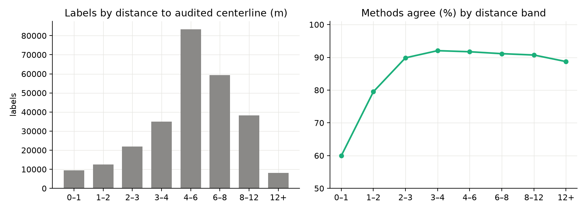

**The heading method's own margin.** Agreement is 56% when the label ray runs within 5° of the road axis, 71% at
5–10°, 84% at 10–20°, 90% at 20–30°, and 92–95.5% beyond. 7.8% of labels sit under 10°.

**The camera's offset from the audited street.** This is the dominant one. Agreement is **99.3%** when the camera
is within 1 m of the audited centerline, 98.1% at 1–2 m, 96.4% at 2–3 m, 92.3% at 3–5 m, 77.5% at 5–8 m, 46.9% at
8–15 m and 32.5% beyond 15 m. The camera is more than 5 m off the audited centerline for **20.4%** of labels (p75 of
the offset is 4.3 m, p90 8.3 m). When the camera is on the street the two methods are the same method; the
disagreement is almost entirely labels whose camera is somewhere else.

| agreement (%) | camera 0–1 m | 1–2 | 2–3 | 3–5 | 5–8 | 8–15 | 15+ |
|---|---|---|---|---|---|---|---|
| n | 68,729 | 60,596 | 40,478 | 42,007 | 27,130 | 20,676 | 6,636 |
| agree | 99.3 | 98.1 | 96.4 | 92.3 | 77.5 | 46.9 | 32.5 |

**By label type.** `SurfaceProblem` 96.0%, `Obstacle` 95.3%, `NoSidewalk` 93.6%, `Occlusion` 91.7%, `Signal` 89.4%,
`NoCurbRamp` 87.8%, `CurbRamp` 86.9%, `Other` 78.7%, and **`Crosswalk` 51.2%**. The curb-ramp types are the
corner case in both senses (§4.5); a crosswalk is in the roadway, and 35% of them are within 1 m of the centerline,
so a side is not a well-posed question for that type.

### §4.3 RQ3: stability under the #4818 reposition

Evolution 352 replaced the `approximation2` position of 197,330 Seattle labels with `approximation3`; 167,218 of
them are real labels with a side under both positions. **2.2% changed geometric side.** The flips are a function
of how close the label now sits to the line: 26.7% within 1 m, 12.0% at 1–2 m, 5.0% at 2–3 m, 1.6% at 3–4 m, 0.2%
at 4–6 m and 0.0–0.1% beyond. Measured against the *old* distance the profile is the same (27.6 / 8.2 / 1.6 / 0.2%),
so this is the geometry of a point crossing a line, not a property of either estimator. By type, `NoSidewalk`
flipped 4.3% and `Crosswalk` 9.2%; the rest 0.9–1.7%. No human label changed street (352 reattached AI labels only;
0.0% of these rows moved edge).

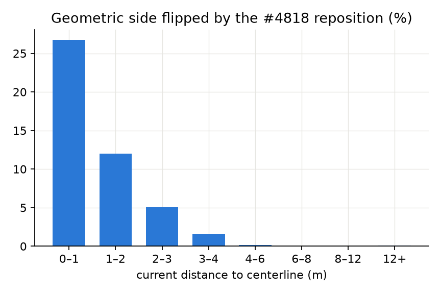

The heading method's inputs (`pano_x`, `camera_heading`, the pano's own position) were untouched by 352, so its
flip rate is zero by construction. Under a 1 m floor the geometric method's rate falls to **1.3%** (2,075 of
161,196), under 2 m to 0.7%. This is the number a stored column has to live with, and the reason its recompute has
to ride whatever recomputes the position.

### §4.4 RQ4: ground truth

#### §4.4.1 Is the SDOT attachment right?

1,233,020 four-metre samples of SDOT sidewalk; 1,135,613 (92.1%) attach to a parallel street edge within 18 m. The
compass direction from the edge to the attached sample matches SDOT's own cardinal `SIDE` field **exactly for
95.0%** of the 4,537 km sampled, and exactly-or-one-point-off (N vs NE, the boundary cases of a 45° bin) for
98.5%. Paved metres split 1,745 km right / 1,650 km left of the edges' digitized direction, so the sign has no
bias. The attachment can be trusted at the block level.

#### §4.4.2 One-sided streets

| coverage class | edges | km |
|---|---|---|
| paved both sides (≥ 60% each) | 15,169 | 1,642 |
| paved one side only (≥ 75% one side, ≤ 10% anything on the other) | 988 (806 right, 182 left) | 73 |
| nothing either side | 2,680 | 72 |
| mixed / partial | 8,808 | 866 |

Seattle is mostly two-sided; the one-sided edges carry 744 `NoSidewalk`, 1,704 `Obstacle`/`SurfaceProblem` and
2,889 curb-ramp labels. The 806:182 asymmetry is OSM digitization direction (the city's north–south streets are
mostly drawn one way), not a sign error (§4.4.1).

#### §4.4.3 `NoSidewalk` on one-sided streets: bare side

The truth: a `NoSidewalk` label on a one-sided edge belongs on the bare side. 738 labels survive the
crowd-rejection filter (98.9% of them have never been validated at all, which is the queue policy #4715 describes).

Raw, the numbers are poor for both methods: **geometric 72.0%, heading 62.1%**. The distance from each label to
SDOT's paved line on the paved side explains why:

| label's distance from the paved walkway | n | geometric | heading |
|---|---|---|---|
| on the paved line (≤ 4 m) | 117 | 1.7% | 15.8% |
| 4–6 m | 49 | 65.3% | 64.6% |
| across the street (6–20 m) | 478 | **93.7%** | **77.1%** |
| far (> 20 m) | 94 | 52.1% | 42.2% |

One label in six sits *on* the walkway SDOT calls paved. Both methods put those on the paved side and agree with
each other 83% of the time, and the heading method reaches its answer without reading the position at all: so
these are not side errors. They are places where the labeler and the inventory disagree about whether a sidewalk
exists (the labels are tagged "street has no sidewalks" as often as "street has a sidewalk", 263 vs 155, on
streets SDOT says have one), or where the inventory has changed since the label (504 of 738 are from 2019; the
SDOT layer is current). 7 edges account for 102 of the wrong labels, and one user's 43 labels are all "wrong".
The far group is labels 20 m or more from any walkway, past the frontage. The truth set is only clean in the
middle band, and there **the geometric method is right 93.7% and the heading method 77.1%**; on the 92 labels in
that band where the two disagree, the geometric side is the right one **94.6%** of the time.

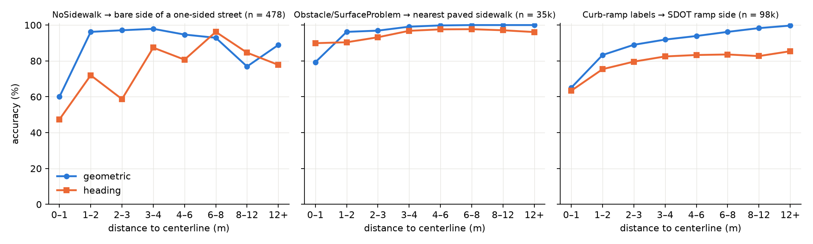

#### §4.4.4 `Obstacle` / `SurfaceProblem`: paved side, and the nearest paved sidewalk

**One-sided streets, paved side as truth** (1,258 labels not rejected by the crowd; 26% of the raw 1,704 *were*
rejected, a high rate that already says something about labels on these streets): geometric 81.1%, heading 83.5%,
and on the 84 disagreements the heading method is right 68%. This is the only truth set the heading method wins,
and the same placement split shows the set is wrong, not the method: 845 labels sit on the paved line (geometric
97.4%, heading 95.7%), but 213 sit 6–20 m across from it, on the bare side, and there the "truth" scores the
geometric method at 26.8%. An obstacle in the pedestrian path of a street with no sidewalk on that side is a
legitimate label (it is what the tool asks for), so the paved side is not where these labels belong, and the
construct fails for this type. Its on-the-line subset is a consistency check the methods pass.

**Nearest paved sidewalk, any street.** Each `Obstacle`/`SurfaceProblem` label within 6 m of a paved SDOT sample
on one side of its audited edge, and at least 3 m farther from any on the other side, is scored against the side
the near sidewalk is on: 34,944 labels. This is position-dependent with a road-width margin (like the curb-ramp
truth below), so it flatters the geometric method on two-sided streets, and its value is the heading method's
failure profile at scale: **geometric 99.7%, heading 97.1%**; on the 948 disagreements the geometric method is
right 96.4%. By camera offset the heading method goes 99.7 / 99.4 / 99.7 / 98.7 / 88.4 / 45.0 / 18.5% across the
seven offset bands while the geometric method stays at 99.2–99.8%; by heading margin it goes 58.8% under 5° to
99.4% above 60°.

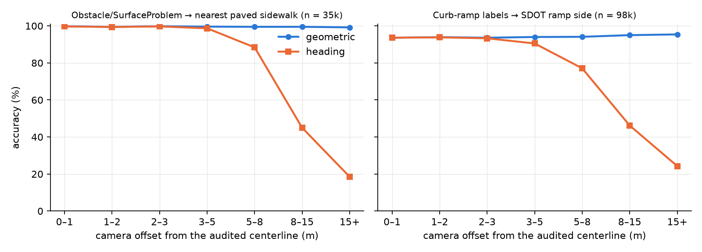

#### §4.4.5 Curb-ramp labels against SDOT's ramp points

108,994 of the 146,572 `CurbRamp`/`NoCurbRamp` labels have an SDOT ramp record within 15 m; 4,937 are ambiguous
(a ramp on the other side within 3 m of the same distance) and 98,067 unambiguous, not-rejected labels are scored
against the ramp's side of the audited edge. **Geometric 94.0%, heading 82.6%** (`CurbRamp` 96.6 / 84.4,
`NoCurbRamp` 81.8 / 73.9). On the 12,880 disagreements the geometric method is right **93.4%**. Restricting to
labels within 6 m of their ramp (81,685, where the corner assignment cannot be wrong) gives geometric 99.7% and
heading 86.8%. The heading method's curve against camera offset is the same shape as in §4.4.4 (93.6% under 1 m,
77% at 5–8 m, 46% at 8–15 m, 24% beyond); the geometric method sits at 93.6–95.4% throughout, and its residual is
the truth's own ambiguity at corners (the 0–1 m band, where a click on the corner apron cannot be sided), not the
camera.

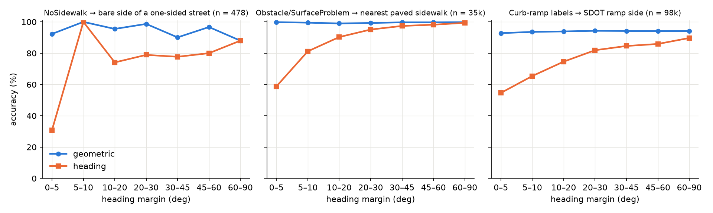

#### §4.4.6 Measured positions

For the 82,833 depth-era labels at least 3 m from the centerline, the geometric side of the *measured* position is
as good as truth for the heading method alone: it agrees **90.9%**, from 55.8% under 5° of heading margin to 96.7%
above 60°, and 96.6–97.0% for `NoSidewalk`, `Obstacle` and `SurfaceProblem` against 86.7–87.7% for the curb-ramp
types.

#### §4.4.7 The disagreement test

Both methods answer identically on ~90% of labels, so only the rest can rank them. Per truth set:

| truth set | n | agree | accuracy when they agree | disagreements | geometric right | heading right |
|---|---|---|---|---|---|---|
| `NoSidewalk`, across the street from the paved side (§4.4.3) | 463 | 80.1% | 94.9% | 92 | **94.6%** | 5.4% |
| curb-ramp labels vs SDOT ramp (§4.4.5) | 97,632 | 86.8% | 94.1% | 12,880 | **93.4%** | 6.6% |
| on-sidewalk labels vs nearest paved sidewalk (§4.4.4) | 34,686 | 97.3% | 99.8% | 948 | **96.4%** | 3.6% |
| on-sidewalk labels, paved side of a one-sided street (§4.4.4, contaminated) | 1,258 | 93.3% | 84.6% | 84 | 32.1% | **67.9%** |

The "accuracy when they agree" column is a read on each truth set's own noise (the methods cannot both be right and
disagree with the truth unless the truth is wrong): 94–95% for the two independent sets, 99.8% for the
position-dependent one.

#### §4.4.8 Distance from the camera

The estimator's error runs along the ray and grows with distance
([#5084](https://github.com/ProjectSidewalk/SidewalkWebpage/issues/5084)), so a far label might be expected to be
sided less reliably. It is not. Geometric accuracy by camera-to-label distance, on the two clean truth sets:

| camera → label | 0–3 m | 3–5 | 5–8 | 8–12 | 12–16 | 16–20 | 20–24 | 24+ |
|---|---|---|---|---|---|---|---|---|
| on-sidewalk vs nearest paved (n = 34,931) | 97.5% | 98.5% | 99.7% | 99.9% | 99.9% | 99.8% | 99.6% | 100% |
| curb ramps within 6 m of their ramp (n = 81,668) | 99.0% | 99.6% | 99.7% | 99.8% | 99.7% | 99.3% | 98.9% | 99.7% |
| *median distance to the centerline, curb ramps (m)* | 4.9 | 5.1 | 5.2 | 5.7 | 6.2 | 6.4 | 6.9 | 8.0 |

Sliding a label along its ray only changes its side where the ray crosses the centerline, and a ray that crosses
the centerline puts the label near the line whatever the camera distance. The far labels are the easy ones: the
median label 24 m or more from its camera sits 8–10 m from the line. The slight dip in the first column is the
near-camera labels that are also near the line. The heading method is the one that degrades with distance (94% at
0–3 m to 85–88% beyond 5 m on the ramp set), and only mildly. Median camera-to-label distance is 8.6 m (p10 4.5 m,
p90 15.9 m).

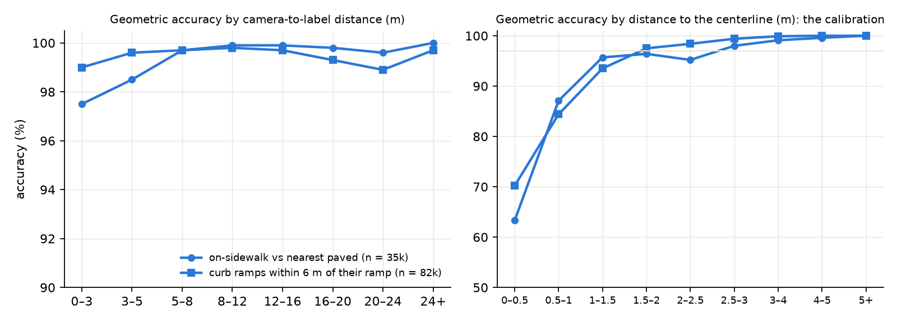

### §4.5 RQ5: which street is the frame

For 12.0% of labels the street nearest the estimated position is not the audited street: 2.7% of `NoSidewalk`,
5.6–5.7% of `Obstacle`/`SurfaceProblem`, but **16.7% of `CurbRamp` and 21.4% of `NoCurbRamp`**, whose median label
sits 7–8 m from the nearer end of its edge. For the camera the figure is 36.9% overall and 53–58% for the curb-ramp
types: at an intersection the pano is in the junction, nearer the cross street as often as not. That is the
mechanism behind every heading-method number above: its "road bearing at the camera" is the wrong road for half of
all corner labels.

A persisted side has to be relative to `label.street_edge_id`. It is the one street that is a stored fact rather
than a spatial query, it is the street the labeler was actually walking, and the truth sets above are all scored
in that frame. For a corner label the side then answers "which side of the *audited* street is this corner on",
which is the question a per-side `NoSidewalk` or topology consumer asks.

### §4.6 RQ6: a decision rule and what it leaves unresolved

The geometric method's margin is its distance to the centerline, and every table above says the same thing about
it: under 1 m the side is a coin flip (agreement 60%, truth accuracy 57–79%, reposition flip rate 27%); at 1–2 m it
is usable (83–96% on the truth sets, 12% flip rate); from 2 m on it is as good as the truth sets can measure.

| rule | coverage | `NoSidewalk` | `Crosswalk` | reposition flips among decided |
|---|---|---|---|---|
| geometric, no floor | 99.7% | 99.5% | 100% | 2.2% |
| **geometric, `NULL` under 1 m** | **96.2%** | **93.4%** | 64.7% | **1.3%** |
| geometric, `NULL` under 2 m | 91.5% | 84.8% | 41.7% | 0.7% |
| under the floor, fall back to the side both methods agree on (1 m floor) | 98.3% | 97.2% | 81.4% | — |

The agreement fallback was tested on the truth sets in the 0–1 m band: when both methods agree there they are right
58.8% (`NoSidewalk`, n = 28), 71.4% (curb ramps, n = 1,201) and 97.2% (nearest-paved on-sidewalk, n = 150) of the
time. It buys two points of coverage at roughly 70% accuracy, and the heading method's own margins (camera offset,
heading angle) do not rescue it: the labels near the line are near the line for both. Not worth the second code
path.

Abstention curves on the pooled truth set (dominated by curb ramps) say the same: raising the geometric floor from
0 to 3 m moves accuracy 93.7% → 94.8% for 10 points of coverage; raising the heading floor to 30° moves it
82.4% → 86.7% for 34 points.

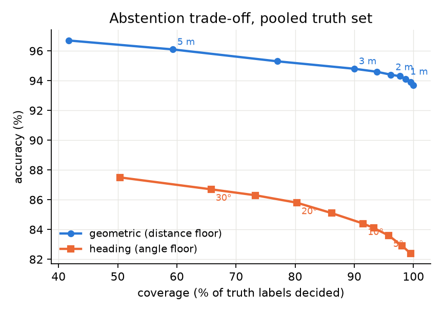

**Hybrids.** The natural follow-up is whether a combination beats either method alone. Every rule that mixes the two
was scored on the pooled clean truth sets (on-sidewalk vs nearest paved plus curb ramps within 6 m of their ramp;
116,056 labels where both methods decide):

| rule | coverage | accuracy | wrong |
|---|---|---|---|
| geometric, no floor | 100% | 99.67% | 385 |
| geometric, `NULL` under 1 m | 99.3% | 99.81% | 216 |
| geometric, `NULL` under 2 m | 97.6% | 99.88% | 135 |
| heading, no floor | 100% | 89.84% | 11,788 |
| heading only where it is confident (camera < 2 m off the street, ray ≥ 20° off the axis) | 41.8% | 99.81% | 93 |
| geometric ≥ 1 m, else confident heading | 99.4% | 99.81% | 223 |
| geometric ≥ 1 m, else the side both agree on | 99.8% | 99.76% | 279 |
| only where both agree | 89.9% | 99.76% | 252 |
| both agree, or geometric ≥ 2 m | 99.6% | 99.77% | 262 |

A learned combination does no better. A logistic regression on the signed margins of both methods (the geometric
distance, the heading angle, the heading angle discounted by camera offset), fit and scored with 5-fold
cross-validation, and compared with the plain geometric floor at matched coverage so both abstain on the same number
of labels:

| coverage | learned hybrid | geometric floor | geometric |
|---|---|---|---|
| 100% | 99.70% | 0 m | 99.67% |
| 99% | 99.83% | 1.26 m | 99.84% |
| 97% | 99.90% | 2.19 m | 99.90% |
| 95% | 99.93% | 2.63 m | 99.93% |
| 92% | 99.95% | 3.08 m | 99.95% |
| 90% | 99.96% | 3.31 m | 99.96% |

The reason is structural rather than a matter of tuning. The estimated position lies *on* the heading ray: the
estimator is that ray plus a distance along it. So the heading method holds a strict subset of the information the
geometric method has, and can only add something where the distance estimate is wrong by enough to carry the label
across the centerline. The calibration in §5.4 already isolates that region as the sub-metre band, and there the
heading method is itself a coin flip (798 labels within 1 m of the line: geometric 78.8%, heading 77.2%). Filling
that band with the heading method only where it is confident buys 0.1 points of coverage at 89% accuracy on 65
labels. In the other direction, a confident heading reading (camera within 1 m of the centerline, ray ≥ 30° off the
axis) never disagrees with the geometric side beyond 2 m from the line: zero such labels. Where the heading method
is sure, the geometric method is already right; where the geometric method is unsure, so is the heading method.
There is no second code path to build.

### §4.7 Six labels, drawn

Each pair is one label chosen by rule, not by hand: `analyze_street_side.py` ranks each situation's candidates by
closeness to the candidate set's median distance, and `fetch_share_images.py` takes the first that has a street-level
image on the Seattle server (older labels often have none). The map shows the audited street with its digitized
direction, SDOT's sidewalk lines and ramp points, the camera, and the two readings: the camera-to-label ray the
heading method signs, and the perpendicular to the centerline the geometric method measures. Beside it is the
label's share image, the street-level view with the label-type marker at the labeled spot (`case_maps.py` composites
the marker from the stored canvas position, because the Seattle deployment serves its share images without one).

Each figure stands alone with its own legend. The counts are each situation's candidate pool.

**Typical: camera on the street, both methods agree.** [267987](https://sidewalk-sea.cs.washington.edu/label/267987)
`CurbRamp`, 9,243 candidates.

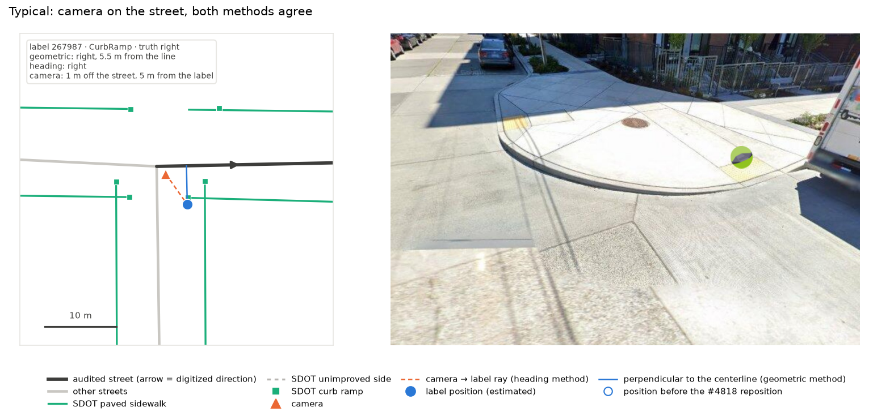

Camera 1 m off the street, 5 m from the label; both methods say right, and SDOT's ramp point sits beside the label.

**Corner: camera on the cross street, heading method wrong.** [114352](https://sidewalk-sea.cs.washington.edu/label/114352)
`CurbRamp`, 5,835 candidates.

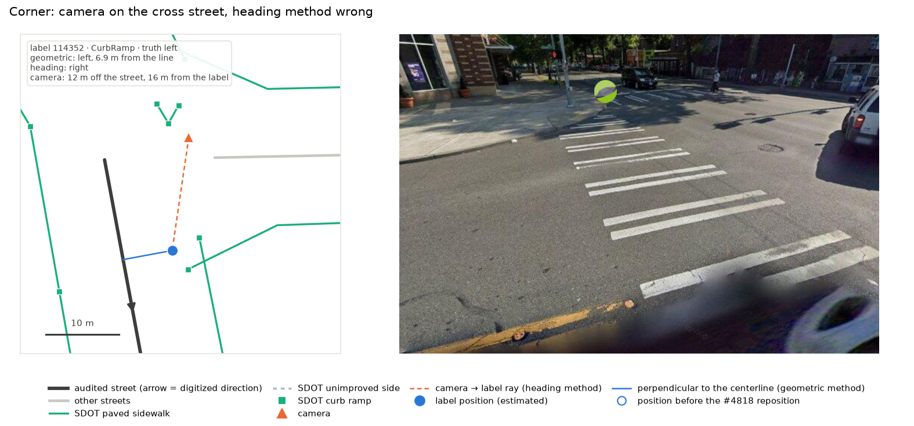

Camera 12 m off the audited street, on the cross street; the ray crosses the audited centerline, so the heading
method says right while the label and the SDOT ramp are on the left. This is §5.1 in one picture.

**Within 1 m of the centerline: the reposition flipped the side.** [293679](https://sidewalk-sea.cs.washington.edu/label/293679)
`CurbRamp`, 639 candidates.

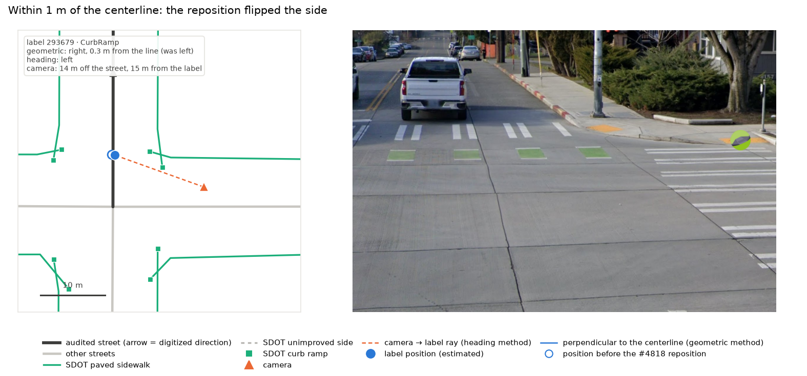

0.3 m from the line, seen from 15 m away on the cross street; the #4818 reposition moved it from left to right.
`NULL` under the rule.

**Far from the camera: the side is still clear.** [99610](https://sidewalk-sea.cs.washington.edu/label/99610)
`SurfaceProblem`, 41 candidates.

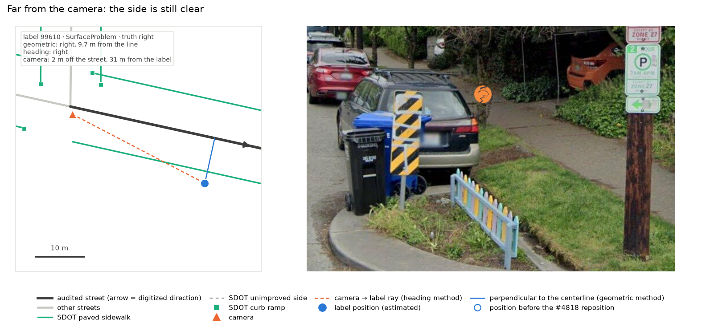

31 m from the camera and 10 m from the line: the ray runs along the street, so the side is not in doubt (§4.4.8).

**NoSidewalk on a one-sided street: on the bare side.** [299692](https://sidewalk-sea.cs.washington.edu/label/299692)
`NoSidewalk`, 352 candidates.

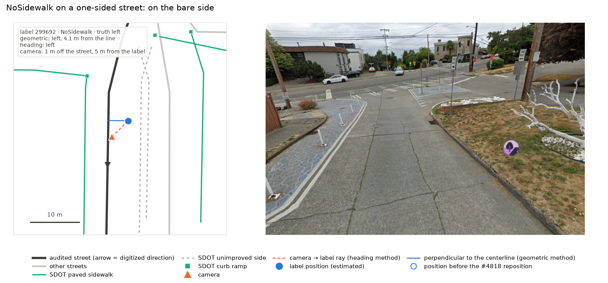

On the unimproved side of a one-sided street, 4 m from the line; both methods agree with SDOT.

**NoSidewalk on the walkway SDOT calls paved: not a side error.** [285511](https://sidewalk-sea.cs.washington.edu/label/285511)
`NoSidewalk`, 53 candidates.

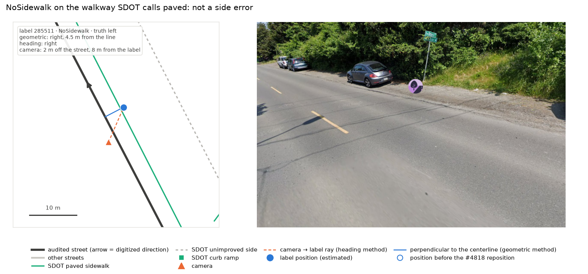

Sits on the walkway SDOT calls paved; both methods put it there. Not a side error: the label and the inventory
disagree about whether a sidewalk exists (§4.4.3).

### §5.1 Why the heading method loses, and why that is not what the ticket expected

The ticket's intuition was that the bearing is the reliable part of a label and the distance the unreliable part,
so a side should come from the bearing alone. The first half is right, and it is *also* why the geometric method
works: `approximation3` takes its bearing exactly from `pano_x` (the same number the heading method uses) and its
error is almost entirely along that ray ([#5084](https://github.com/ProjectSidewalk/SidewalkWebpage/issues/5084):
0.40 m median distance error, no lateral term). A position error along the ray moves the label toward or away from
the camera and only crosses the centerline when the ray itself crosses it, which is exactly the near-axis case the
heading method also cannot decide. The two methods share their failure near the line.

What the heading method adds is an assumption the geometric method does not make: that the camera is on the
audited street. It is not, for one label in five, and for more than half of all corner labels the nearest street to
the camera is the cross street. Then "the road bearing at the camera's foot" is a bearing on the wrong road (or the
right road at the wrong place, when the junction geometry folds the foot point onto a segment the label is not
beside), and the sign of the angle is noise. The geometric method never asks where the camera is: it projects the
label itself, wherever the ray started, so a pano in the middle of an intersection costs it nothing. The camera
offset is the whole story of fig. 5: both methods at 99%+ on the street, the heading method alone falling off as the
camera leaves it.

A hybrid ("heading when the camera is on the street, geometric otherwise") is available and was not adopted because
where the camera is on the street the two methods already give the same answer 99.3% of the time. The heading
method has nothing to contribute where it is reliable, and is unreliable exactly where a second opinion would help.

### §5.2 What the truth sets can and cannot say

Two of the truth sets are independent of the label position (a `NoSidewalk` label on a one-sided street belongs
on its bare side; an on-sidewalk label on its paved side) and two are position-dependent with a road-width margin
(the nearest ramp, the nearest paved sidewalk). The independent ones are small (hundreds) and noisy; the dependent
ones are large (tens of thousands) and flatter the geometric method by construction on two-sided streets. The
report leans on neither alone but on the disagreement test (§4.4.7), which is the same across all four: on the
labels the methods split on, the geometric side is right 93–96% of the time, and the one set that says otherwise
is the one whose construct fails on inspection.

The `NoSidewalk` set also carries a finding of its own. One label in six on a one-sided street sits on the walkway
SDOT calls paved. Whether that is a labeler decision (an asphalt shoulder or a walkway with no curb, tagged "street
has no sidewalks"), an inventory change since 2019, or a bad label, it is a place where Project Sidewalk and the
city disagree about the existence of a sidewalk, and no side computation resolves it. A per-side `NoSidewalk` rule
should expect that noise floor. The 60-label hand-check sample
(`2886-street-side/hand-label-sample.csv`, stratified by type and by whether the methods agree, with a Gallery
link per label) is the place to look at these; this report did not view imagery.

### §5.3 What is deliberately not claimed

- No number here is a city-independent constant. Seattle is a grid city with an unusually complete sidewalk
  inventory; the 1 m floor and the 20% camera-offset share will differ elsewhere, though the geometry that
  produces them will not.
- The curb-ramp and nearest-sidewalk truths cannot distinguish a right side from a right corner; they say the
  geometric side agrees with the corner the label is nearest, which is the weaker claim.
- `Crosswalk` labels get a side because the column is per label, not because the side means much; a consumer
  should treat that type's value as "which end of the crossing", and 35% of them are `NULL` under the floor.
- No panorama was looked at. The six maps in §4.7 verify the geometry against SDOT's lines, not the imagery; the
  share links there and the hand-label sample exist so that someone can.

### §5.4 The margin is the confidence

Accuracy is a clean, monotone, type-independent function of the label's distance from the centerline, and the
curve is the same on both clean truth sets:

| distance to centerline | 0–0.5 m | 0.5–1 | 1–1.5 | 1.5–2 | 2–2.5 | 2.5–3 | 3–4 | 4–5 | 5+ |
|---|---|---|---|---|---|---|---|---|---|
| on-sidewalk vs nearest paved (n = 34,944) | 63% | 87% | 96% | 96% | 95% | 98% | 99.1% | 99.6% | 100% |
| curb ramps within 6 m of their ramp (n = 81,685) | 70% | 84% | 94% | 98% | 98% | 99.4% | 99.9% | 100% | 100% |

So there is no need for a separate confidence score, or a low/medium/high bucket that then has to be kept
calibrated. The margin itself is the confidence, and it is already in metres. Stored signed (positive on the left of
the edge's digitized direction, negative on the right), one number carries both the side and its reliability, is a
physical quantity that does not go stale when the estimator is refit, and lets each consumer pick its own threshold
from the table above. The 1 m `NULL` floor becomes the convenience default for consumers that do not want to think
about it, rather than the only signal. It is exactly as informative for a label 4 m from the line (a near-certainty)
as for one 0.4 m from it (a coin flip).

What a far label *is* less certain about is which street it belongs to (the frame, §4.5), not which side. That is a
separate question with a separate answer: the side is relative to the audited edge, and the along-edge fraction is
the natural companion to store when [#1155](https://github.com/ProjectSidewalk/SidewalkWebpage/issues/1155) wants a
topology.

## §6 · Recommendation, and the feature it implies

**Persist the geometric side as a signed offset from the audited street's centerline, and derive the `left`/`right`
enum from it with a 1 m floor.** Concretely:

1. **Schema (one evolution).** A nullable `label_point.centerline_offset_m double precision`: the geodesic distance
   from the label's position to `street_edge.geom` for the label's `label.street_edge_id`, positive on the left of the
   edge's digitized direction and negative on the right; `NULL` only when the label has no position. Beside it,
   `CREATE TYPE street_side AS ENUM ('left', 'right')` and `label_point.street_side`, `left` when the offset is
   ≥ 1 m, `right` when ≤ −1 m, `NULL` in between. Make the enum a `GENERATED ALWAYS AS (...) STORED` column so it
   cannot drift from the offset it summarises (a plain column recomputed alongside is the fallback if a generated
   enum column proves awkward in Slick). The same evolution backfills every row with one `UPDATE` (a `label_point`
   ⋈ `label` ⋈ `street_edge` join on primary keys, one pass over `label_point` per schema, no correlated subquery).
   Compute the sign in a conformal projection so the foot point is right at any latitude without a per-city SRID:
   `ST_Transform(geom, 3857)` for the locate and cross product, `ST_Distance(geography)` for the magnitude. Mirror
   the enum in Scala the way `computation_method` is (`ComputationMethod.scala`, `MyPostgresProfile`'s
   `createEnumJdbcType`).
2. **Insert path.** Where `ExploreService` inserts a `label_point` (crowd and AI submissions both go through
   `LabelPointTable.insert`), compute the side in the same transaction against the label's `street_edge_id`, using
   the same expression as the backfill. The expression should live in one place; the cleanest is a SQL function
   defined by the evolution that both the backfill and the insert-path `UPDATE` call, so the two cannot drift. (A
   trigger on `label_point.geom` would make drift impossible by construction; the schema has no trigger today, so
   that is a judgment call for the PR.)
3. **Recompute contract.** Any future reposition of `label_point.geom` (a 352-style backfill, a change of
   `street_edge_id` such as 352's AI reattach, an estimator refit) recomputes `centerline_offset_m` in the same statement (the enum follows if it is generated).
   §4.3 is the cost of forgetting: 2.2% of stored sides silently wrong after a reposition, 27% of those near the
   line.
4. **API.** `street_side` (`left` / `right` / `null`) and `centerline_offset_m` on `/v3/api/rawLabels` and the label
   endpoints that carry `street_edge_id`, snake_case per
   [#3871](https://github.com/ProjectSidewalk/SidewalkWebpage/issues/3871), documented as relative to the digitized
   direction of `street_edge_id`, with the §5.4 calibration table in the docs so a consumer can read "2 m ≈ 97%" off
   it and choose its own floor. A consumer that wants a cardinal side can derive one
   from the edge's geometry; a consumer that wants "same side as label X" compares the two values on a shared
   `street_edge_id`, which is the query [#1155](https://github.com/ProjectSidewalk/SidewalkWebpage/issues/1155) and the
   `NoSidewalk` queue rule actually need.
5. **Tests and docs.** A fixture edge with points on each side, on the line, and inside the floor, checked through
   the SQL function and the Scala mapping; the API spec asserting the field; a paragraph in
   `docs/label-latlng-estimation.md` (the side is derived from the position that document describes) and the
   `rawLabels` API docs page.

Then, separately, the small PR that adds the per-side `NoSidewalk` rule to the queue policy.

## Reproducing this report

```bash
python3.13 tools/street_side/download_sdot.py tools/street_side/data           # SDOT layers (network)
docker exec -w /home/<worktree> projectsidewalk-web python3.13 tools/street_side/street_side.py load
docker exec -w /home/<worktree> projectsidewalk-web python3.13 tools/street_side/street_side.py compute   # ~4 min
docker exec -w /home/<worktree> projectsidewalk-web python3.13 tools/street_side/street_side.py export
docker exec -w /home/<worktree> projectsidewalk-web python3.13 tools/street_side/analyze_street_side.py
python3 tools/street_side/fetch_share_images.py                                                # §4.7 picks + images (network)
docker exec -w /home/<worktree> projectsidewalk-web python3.13 tools/street_side/case_maps.py      # §4.7 figures
```

`tools/street_side/out/summary.json` holds every number quoted above; `tables.md` every table, including the ones
this report summarises. The scratch schema (`experiment_2886`) is left in place for follow-up queries; `DROP SCHEMA
experiment_2886 CASCADE` removes every trace.
